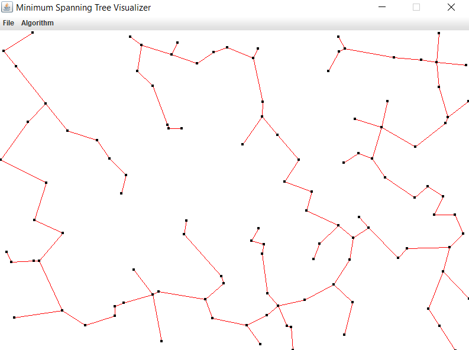

# Minimum Spanning Tree Visualizer
This is a mini-project for the subject - `Design and Analysis of Algorithms (DAA)`. The visualizer is simple, you can click to add nodes or create a random graph of 100 nodes. Then you can use either Prim's or Kruskal's and visualize the algorithm running.

  

